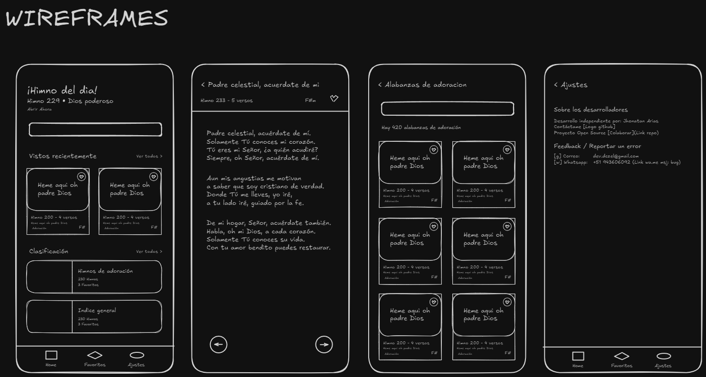

# Himnario Adonai

> [!WARNING]
> App en desarrollo, estado actual: Developing the MVP

> [!IMPORTANT]
> Pre-alpha version available! You can check out the live preview on Vercel.
>
> 
> **Important: This is just a web preview, the project is focused on Android development, so many of the features are mobile-only and won't be displayed properly on the web.**

## Descripción
Himnario Adonai es una app que facilita el tener los himnos del la reunión al a mano para le grupo cristiano 'Adonai', los usuarios pueden acceder a la base de datos de himnos propios, ver acordes, reproducir canciones y compartirlas rápidamente.
La aplicación esta optimizada para ser rápida, ligera y fácil de usar, con un enfoque especial en aplicaciones de consumo de streaming y minimal apps.

## Características Principales
- **Explorar Himnos**: Accede a un índice completo de himnos y selecciona tus favoritos.
- **Actualización en Línea**: Conecta con una base de datos remota para mantener tu colección de himnos siempre actualizada.
- **Acordes Detallados**: Visualiza los acordes de cada canción, incluyendo figuras para guitarra, piano y otros instrumentos.
- **Reproducción de Canciones**: Escucha tus himnos favoritos directamente desde la app.
- **Transporte de Acordes**: Ajusta los acordes según tus necesidades.
- **Exportación a PDF**: Guarda y comparte himnos en formato PDF.
- **Registro de Himnos**: Añade nuevos himnos fácilmente mediante fotos de WhatsApp.

## Wireframes (MVO)
A continuación se presentan los wireframes que ilustran el diseño y la funcionalidad de la aplicación:



## Instalación
Para instalar y ejecutar la aplicación en tu dispositivo Android, sigue estos pasos:

1. Clona este repositorio:
    ```bash
    git clone https://github.com/tu-usuario/himnario-adonai.git
    ```
2. Navega al directorio del proyecto:
    ```bash
    cd himnario-adonai
    ```
3. Instala las dependencias necesarias:
    ```bash
    npm install
    ```
4. Inicia la aplicación:
    ```bash
    npx expo start
    ```
5. Sigue las instrucciones para desplegar en web, emulador, o un dispositivo por depuración.

## Contribuciones
¡Las contribuciones son bienvenidas! Si deseas colaborar, por favor sigue estos pasos:

1. Haz un fork del repositorio.
2. Crea una nueva rama (`git checkout -b feature/nueva-funcionalidad`).
3. Realiza tus cambios y haz commit (`git commit -am 'Añadir nueva funcionalidad'`).
4. Sube tus cambios (`git push origin feature/nueva-funcionalidad`).
5. Abre un Pull Request.

## Licencia
Este proyecto está bajo la licencia MIT. Consulta el archivo [LICENSE](./LICENSE) para más detalles.

## Contacto
Para cualquier consulta o sugerencia, por favor contacta a [dev.dczel@gmail.com](mailto:dev.dczel@gmail.com).
